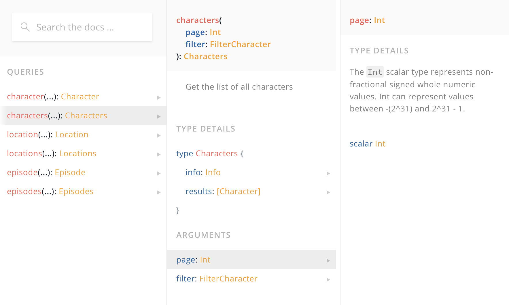
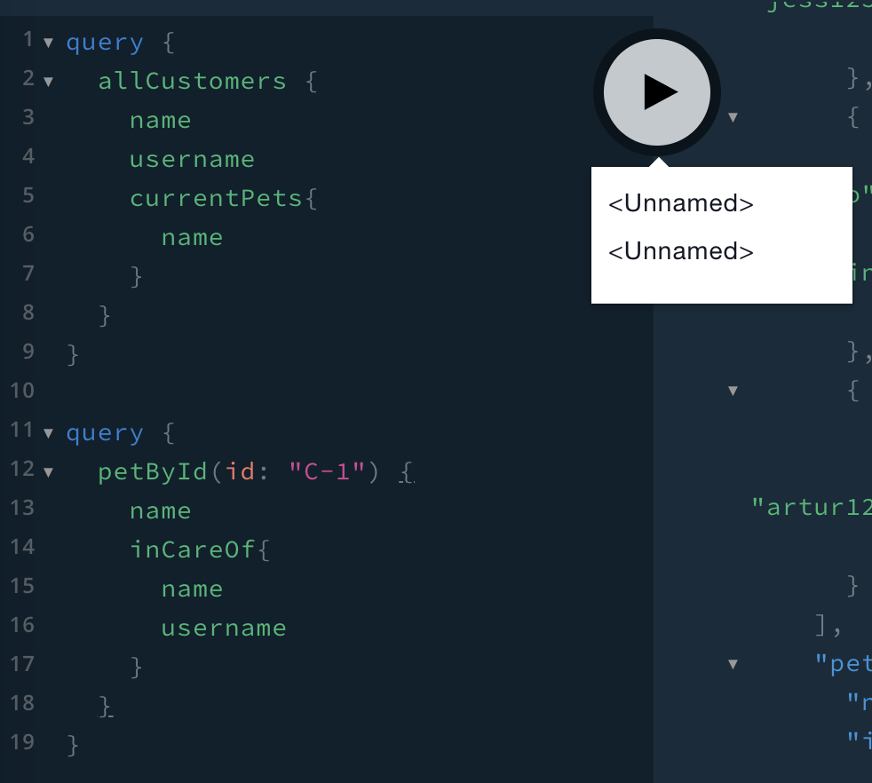
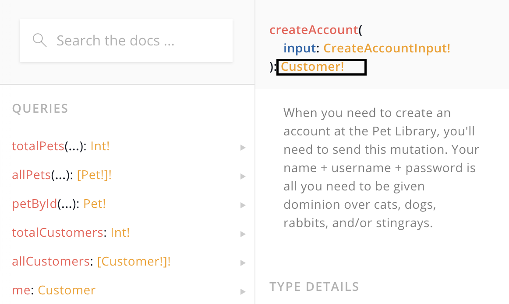

Frontend GraphQL 

Initially created for it to be used to solve FE problems, UI related. Components -> have props -> their props types affect the UI. How do we consume data from the server in the exact shape or type that we need it for the UI, so that we just take it from the server and throw it on the page. 

Since then, graphQL evolved. 

Queries and Mutations: 
We need a query type, and one field that resolves to some type of value. Mutations are pretty much the same. Queries and mutations on the client: since we have them defined on the BE we’re going to issue requests on the frontend and use whatever is defined on the server. 

https://rickandmortyapi.com/graphql

Operation names: 

Are optional. An operation can be anonymous or we could name it by adding the name right after the `query` keyword: 

```
query AllCharacters {
	# an informative comment
  characters {
  	results {
      id
      name
    }
  }
}
```

When we look at the query, everything wrapped in curly braces is called a **selection set**.  
Each piece of data that we’re selecting is called a **field**

Hover on any field name, click `CMD` and you’ll be directed to the definition of the field in the schema. 

The Rick and Morty docs shows us that `characters` have two arguments: 



We could use the arguments like so: 

```
query AllCharacters {
  characters (page: 1) {
  	results{
      id
      name
    }
  }
}
```


We could also add the page as a variable in the bottom section of the playground titled `Query Variables`: 

```
// update the query to use a variable: 

query AllCharacters ($page:Int = 1) {
  characters (page: $page) {
  	results{
      id
      name
    }
  }
}

// in query variables: 
{
  "page":3
}
```

If a variable isn’t given, and the field is nullable - we’ll get all values in response. 
We can set a default value to the field in case no value is passed. 

```
query AllCharacters ($page:Int = 4) {
  characters (page: $page) {
  	results{
      id
      name
    }
  }
}
```

Using more than one variable is much of the same. It’s worth noting we’re using the `FilterCharacter` type which is showing in the docs: 

```
query AllCharacters ($page:Int, $filter: FilterCharacter) {
  characters (page: $page, filter: $filter) {
  	results{
      id
      name
    }
  }
}

{
  "page":1,
  "filter": {
    "name": "Rick Sanchez"
  }
}
```

Let’s filter and only query for characters which are females. You can open a new tab in the playground using the plus sign. 

```
query{
  characters (filter: {gender: "female"}){
    results { 
      id 
      name 
      gender
    } 
  }
}
```

We can then pass in either “male”, “female”, or “unknown”: 

```
query ($gender: String){
  characters (filter: {gender: $gender}){
    results { 
      id 
      name 
      gender
    } 
  }
}
```

You can alias any field you’d like. If we wanted to give a more descriptive name to one of the values, we could use aliases, like so: 

```
query AllCharacters {
  characters {
  	results{
      id
      fullName: name
    }
  }
}

// and after that the response would be: 

"data": {
    "characters": {
      "results": [
        {
          "id": "1",
          "fullName": "Rick Sanchez"
        },
        {
          "id": "2",
          "fullName": "Morty Smith"
        },
        .....
}

// note that `name` is now `fullName` 
```

Say we wanted to get all characters with name “Rick “Sanchez” and also get all characters with name “”Morty Smith”. Writing the query this way will result in an error: 

```
query AllCharacters {
  characters (filter: {name:"Morty Smith"}) {
  	results{
      id
      fullName: name
      gender
    }
  }
  characters (filter: {name:"Rick Sanchez"}) {
  	results{
      id
      fullName: name
      gender
    }
  }
}
```

Note how descriptive the error is: 

```
{
  "error": {
    "errors": [
      {
        "message": "Fields \"characters\" conflict because they have differing arguments. Use different aliases on the fields to fetch both if this was intentional.",
        "locations": [
          {
            "line": 2,
            "column": 3
          },
          {
            "line": 9,
            "column": 3
          }
        ],
        "extensions": {
          "code": "GRAPHQL_VALIDATION_FAILED"
        }
      }
    ]
  }
}
```

It tells us that we’re using the field characters twice with different arguments. It even tells us the solution: `Use different aliases on the fields to fetch both if this was intentional`. 

Writing the query this way will resolve the issue: 

```
query AllCharacters {
  mortyChars: characters (filter: {name:"Morty Smith"}) {
  	results{
      id
      fullName: name
      gender
    }
  }
  rickChars: characters (filter: {name:"Rick Sanchez"}) {
  	results{
      id
      fullName: name
      gender
    }
  }
}
```

The result will group the characters for Rick and Morty in two different groups under the aliases we’ve listed: 

```
{
  "data": {
    "mortyChars": {
      "results": [
        {
          "id": "2",
          "fullName": "Morty Smith",
          "gender": "Male"
        },
        {
          "id": "232",
          "fullName": "Morty Smith",
          "gender": "Male"
        },
        {
          "id": "234",
          "fullName": "Morty Smith",
          "gender": "Male"
        }
      ]
    },
    "rickChars": {
      "results": [
        {
          "id": "1",
          "fullName": "Rick Sanchez",
          "gender": "Male"
        },
        {
          "id": "290",
          "fullName": "Rick Sanchez",
          "gender": "Male"
        },
        {
          "id": "293",
          "fullName": "Rick Sanchez",
          "gender": "Male"
        }
      ]
    }
  }
}
```

**Connecting data points** 

The real power of graphql starts to show up when we start to talk about connecting data points. 

To see this in action, let’s take a look at this pet library playground, which offers Pets and Customers data: https://pet-library.moonhighway.com/

```
query {
  petById(id: "C-1") {
    name
    inCareOf{
      name 
      username
    }
  }
}
```

Here, were getting a pet by ID, then getting the field `incCareOf` which will give us the user that has checked out this pet. We then ask for the subfields name and username of that customer. 

Running this returns: 

```
{
  "data": {
    "petById": {
      "name": "Biscuit",
      "inCareOf": {
        "name": "testuser",
        "username": "testuser"
      }
    }
  }
}
```

This data also appears in the customer data. Every pet has the `inCareOf` which holds the customer name that checked out the pet. Additionally, all customers have a field called `currentPets` which lists all pets they have checked out. 

```
query {
  allCustomers {
    name 
    username
    currentPets{
      name
    }
  }
  petById(id: "C-1") {
    name
    inCareOf{
      name 
      username
    }
  }
}
```

We currently have two unrelated queries we’d like to run separately. Hovering on the play button we see these two queries are anonymous, and clicking it will throw an error: 





```
"message": "This anonymous operation must be the only defined operation.",
```

Graphql is telling us that when we use an anonymous operation - there can only be one. One solution is to name the queries, and after we do that, the play button will have the names for the operations, and we’ll have the ability to choose which one to run when we hover over the play button. 

```
query CustomerPage {
  allCustomers {
    name 
    username
    currentPets{
      name
    }
  }
}

query PetPage {
  petById(id: "C-1") {
    name
    inCareOf{
      name 
      username
    }
  }
}
```

**Mutations**

To change data in Graphql we use a mutation. Our pet library api has mutations for us to use to change the data. 

One of the mutations available to use is `createAccount`. Looking at the docs, this mutations takes an input in the form of  createAccountinput: 

```
type CreateAccountInput {
	name: String!
	username: ID!
	password: String!
}
```

The exclamation mark next to the field means they’re all required. 

```
mutation {
  createAccount(input: {name:"Michal Weismane" username: "Zurda" password:"123123"}) {
    username
	name
  }
}
```

Once you’ve ran this, you should be able to see your customer when you run the query allCustomers: 

```
query getAllCustomers {
  allCustomers {
    username
  }
}
```

We could also use variables to add these values in, so that the mutation operation is shorter: 


```
mutation addCustomer ($input: CreateAccountInput!) {
  createAccount(input: $input) {
    username
    name
  }
}

query getAllCustomers {
  allCustomers {
    username
    name
  }
}

// and in the variable section: 

{
  "input": {
    "name":"another test",
    "username":"234",
    "password":"somepassword"
  }
}
```

Why do we need to specify the subsets fields username and name when we create a customer? 

If we try to add an account without specifying the fields we’ll get another very descriptive error, saying: 

```
"message": "Field \"createAccount\" of type \"Customer!\" must have a selection of subfields. Did you mean \"createAccount { ... }\"?",
```

We can then go to the docs to check what create account returns: 



**Authenticate user using mutations** 

Next, let’s look into the login mutation. This mutation should allow us to login if we already have a username and password. It returns a token, and the customer name: 

```
mutation {
  logIn (username: "234" password: "somepassword") {
   customer {
     name 
  }
    token
  }
} 
```

Once we get our token returned, we should be able to use it to login to the service. To do so, we’ll use the `HTTP HEADERS` section in the bottom of the playground. 

```
// in the headers section 
{
  "Authorization": "Bearer <paste token here>"
} 
```

Once we supply the token in the http header we’ll be able to access data that’s only available for authorised users. 

Let’s add another query to our current tab, and use the `me` operation. According to the docs, `When a Customer is logged in and has a valid authorization token, they can send the me query to return data about themselves. me will return null if a Customer is not logged in.`

```
query getMeData {
  me {
    name 
    username
    dateCreated
    currentPets {
      id
    }
    checkoutHistory {
      pet {
        name
      }
    }
  }
}

// and the data returned: 
{
  "data": {
    "me": {
      "name": "another test",
      "username": "234",
      "dateCreated": "2020-05-09T14:34:31.900Z",
      "currentPets": [],
      "checkoutHistory": []
    }
  }
}
```


Since we’ve just created this user, there are no current pets or checkoutHistory. 

How do we know the http header we added makes any difference? Try removing it, and sending the `Me` query again, and see what you get. 

**Send a mutation as an authorised user**

We’ve used the token to send a `Me` query. Let’s use the token using a mutation this time. 

Let’s try to checkout a pet with name `Luna` and id `D-4`. We can make sure it’s available by running the allPets query, and filtering only the pets with status: AVAILABLE. 

```
mutation Checkout {
  checkOut(id: "D-4") {
    pet {
      name
      id
    }
    customer {
      name
    }
  }
}
```

And after running this, we should be able to see Luna under the `currentPets` field. 

Once a pet has been checked out, we can check them back in using the checkin mutation which takes an id of the pet: 

```
mutation CheckIn {
  checkIn(id: "D-4") {
    pet {
      name 
    }
    checkInDate
    checkOutDate
    late
	}
}

// which returns 
{
  "data": {
    "checkIn": {
      "pet": {
        "name": "Luna"
      },
      "checkInDate": "2020-05-09T16:35:15.022Z",
      "checkOutDate": "2020-05-09T16:30:17.642Z",
      "late": true
    }
  }
}
```


Sadly, we can see we were late in returning Luna. 

Once we’ve checked Luna back in, when we run the all customers query we should be able to see Luna in our `checkoutHistory` but not in our `currentPets` array: 

```
 {
        "name": "another test",
        "username": "234",
        "currentPets": [],
        "checkoutHistory": [
          {
            "pet": {
              "name": "Luna"
            }
          }
```

**Apollo client:** 
Encapsulates HTTP logic used to interact with a graphQL API. The Apollo client saves us setting up a fetcher, etc. Apollo client stores state for the data we get back from the server, it’s also possible to store state that’s created locally on the client side. It depends on no framework. Has nothing to do with a framework (used to be built on top of redux - but no more). You drop it in, and it just works. 

Apollo stores every node that gets returned from the API flat, using a unique ID. Apollo will use the id field value and typeName combined to create a unique index for each individual node. It’s going to store them flat, and the key will be ID + Typename. This is why we should always return an ID -> otherwise we’ll have to change what Apollo saves the nodes by. It’s not a good practice not to return an ID. Either all have IDs OR non of them should have. If none of them have IDs -> we should let Apollo know of another unique field to use for cache. 

Why is it all flat? No nested structure in Apollo cache. Why? Because if something changes, and the nodes were stored in two different locations, you’d have to go into two places to update them.  Since it’s stored flat, there’s only one instance of the node, since it’s a unique id, it only has to update it once. Apollo doesn’t care about relationships, and remembers everything flat. 
