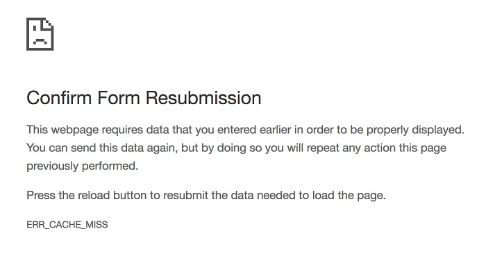
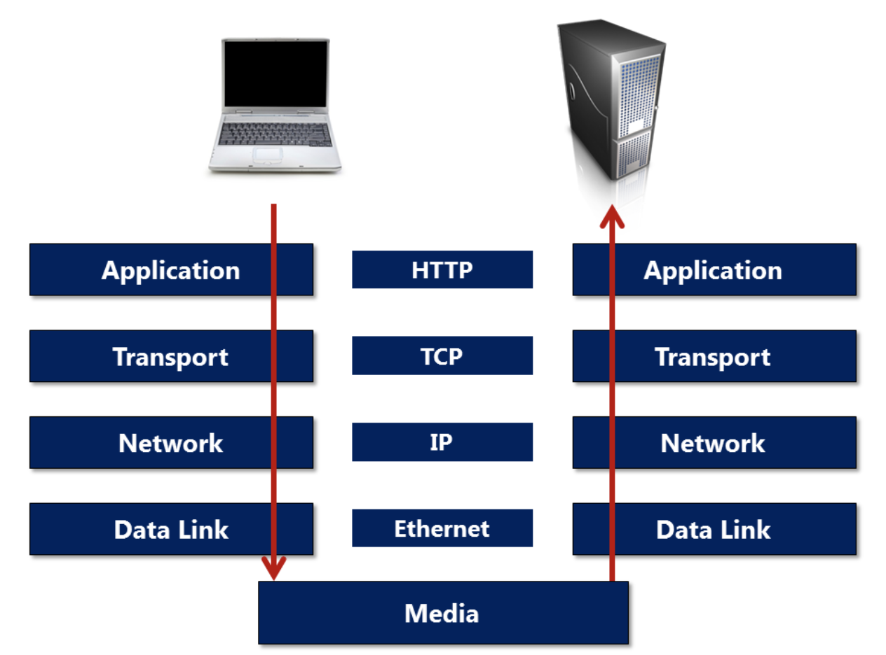
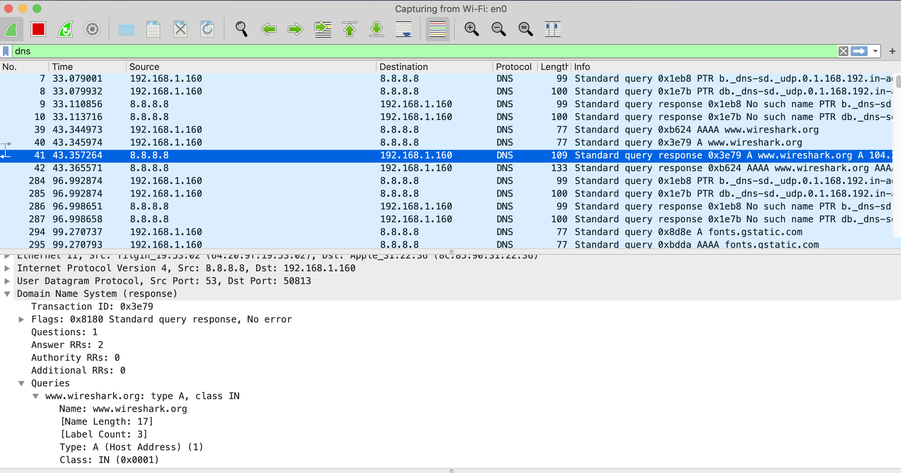

Notes from the book: What every web developer should know about HTTP 

##### Chapter 1: Resources 

URL: Uniform resource locator 
We can break the url into three parts: 

**PRE :**
http (anything before the `://`) is called the. **url scheme**. Describes how to access a particular resource. HTTP stands for hypertext transfer protocol. HSSPS -> secure http.  ftp -> file transfer protocol. Mailto -> email addresses. 

**:**
Everything after the `://` will be specific to a particular scheme (http is different from mailto, and others). 

**AFTER :**
google.com is a host. This host name tells the browser the name of the computer hosting the resource. 

The computer uses the DNS (Domain Name System) to translate google.com into a network address where it’ll send the request for the resource. 

**AFTER HOST**
_page_some-page/ is the **URL path**. Google.com should recognise which resource is being requested using this path. Sometimes a url will point to a file `/logo.png`. However resources can be dynamic. `/some-page` probably does not refer to a file on the server. Instead some application running on `google.com` is running on the host and will take the request to build a resource using content from the database. 

Why not use file name? Associating a page with a technology, for example `some-file.aspx` and then swapping technology will lead to broken urls. Secondly, `some-file/` can be used for SEO (search engine optimization) where it’s best to use descriptive keywords (rather than file names). 

**URL with port number**
`http://google.com:80/some-page/page-name` the number 80 represents **port number** the host is using to listen to http requests. The default port number is 80, so this number is usually omitted. 

`http://google.com/search?q=stuff`
Everything after the question mark is a query (or query string) which contains information about the destination web site. There’s no formal standards and the query string structure depends on technology, but usually is looks like so: `name1=value1&name2=value2`

`https://google.com?page=some-page#second-section`

The part after the # sign is called fragment which is only used on the client side. It identifies a specific section of a resource, and it is not processed by the server.

`<scheme>:<host>:<port>/<path>?<query>#<fragment>`
Worth noting that the path on the urls is case sensitive. However websites will try to make it appear that pages are case insensitive to avoid broken links. 

**URL Encoding**

Space is considered an unsafe character, because space can appear or disappear in printed form. # is also unsafe (because fragments), also ^ because it isn’t always transmitted correctly through all network devices. 

**RFC 3986** (the law for urls) defines the safe characters for URLS to be the alphanumeric characters in US-ASCII, plus just a few special characters like `:` and `/`.

You can still transmit unsafe characters, but they must be percent encoded `%20` for space,  `%5` for ^. 

**Media type/ Content type**

When a host responds to an HTTP request, it returns a resource and specifies the content type (or media type) of the resource. 

To specify the content type, HTTP relies on the multipurpose internet mail extensions — MIME standards. HTTP uses MIME to label content so the client will know what the content contains. For example `text/html` tells the client that’s what the resource is labeled as. 

**File extensions**
In most browsers, the file extension is the last place to go to determine the content type. They can be misleading, and even if we request a JPEG type that doesn’t mean the server has to respond with data encoded to JPEG format. 

Determining content type: 
1. MIME type specified by host 
2. (If 1 doesn’t exist) scan the first 200 bytes of the response and guess the type
3. Finally, if it still falls back - uses the file extension used in the request.

**Content type negotiation**
A resource identified by a single URL can have multiple representations. For example, a page can have instances using different languages. 

When the client makes an HTTP request to a URL, the client can specify the media types it will accept. It is then up to the server to fulfil these specifications. It’s called content negotiation because the server can return whatever it has despite what’s listed in the request. If the host can satisfy the request, the information will arrive at the client in an ideal format for parsing and consumption.

### Chapter 2: Messages 

**Requests and Responses**
The client needs a resource from the server. If the server understands the request and has the resource available it’ll give the correct response. If the server understands the requests but doesn’t have the resource It’ll response and tell the client the problem. If the server doesn’t understand	the request we might not see any response. 

HTTP is a request-and-response protocol. A client sends an http request to a server using a carefully formatted message that the server will understand. A server responds by sending an HTTP response that the client will understand. 

The request and response are two different message types that are exchanged in a single http transaction. The HTTP standards define what goes into a request and response messages. Even if the resource doesn’t exist - the server can still reply to let the client know. 

Raw Request and Response 

Example: redirect messages. The server can respond and tell the client that the resource has moved. It’s then up to the client to parse the response message, and send another request to the new location specified in the response. Any web browser will go to the new location automatically. 

Redirect messages are common. It forces search engines to see one true URL for a given resource (canonical URL), because having it will improve search results rankings for a given resource. 

So, as an example, a request to search for “test” on the bing.com website by going to https://www.bing.com/search?q=test looks like this:

```
GET /search?q=test HTTP/2
Host: www.bing.com
User-Agent: curl/7.54.0
Accept: */*
```

Every request message must include an HTTP method which describes the purpose of the request.  Here are some common **HTTP methods** and what they are intended for:

* GET— retrieve a resource (the most common type of request). Example: retrieving a web page. 
* POST— update a resource. Example: “Add to Cart”. A form element generally initiates a POST request. 
* PUT— store a resource 
* DELETE— remove a resource 
* HEAD - retrieve the headers or metadata for a resource 

In the above, the second line with “Host”, defines which website the request is to be made to. In this case, the request will be sent to the Bing website. If this was changed to “www.google.com”, the request would go to Google.


In the above, _search on the first line is the path. Coupled with the method, the path tells the website /what_ the request _specifically_ wants to do.
In this case, GET /search says: “Please retrieve the results of a search for me.”

In the above, the lines under the Host are headers. Headers are additional data that help a website determine what response to make for the request.
For example, Accept: **/** tells the website that any type of response is okay. This could be made more specific.
User-Agent: curl/7.54.0 tells the website which application is used to make the request.

For example, this might typically say something like Mozilla/5.0 (Macintosh; Intel Mac OS X 10.14; rv:68.0) Gecko/20100101 Firefox/68.0 if you’re making the request from the Mac version of Firefox.
In the above case, a command-line tool, _cURL_, was used to make the request.

Any additional headers may be provided on following lines. A famous type of header is the “cookie” header, which is used to pass reusable data to the website on each request.
For example, if logged-in, a user’s “session” may be passed each time to the website so a user doesn’t have to pass a username and password each time a request is made.

In the above, HTTP/2 on the first line is the HTTP version. Different versions of HTTP handle the details of the interaction between machines differently. The versions commonly used today are HTTP/1.1 and HTTP/2.

**GET and safety**
Safe HTTP methods: don’t do anything dangerous like destroy a resource, submit a credit card transaction, or cancel an account. 
The GET is a safe method. Should only retrieve a resource and not alter the state of the resources. No side affect. 

POST: not safe. Web browsers typically treat GET and POST differently because POST isn’t safe. The best example: refreshing a page achieved by GET request vs a page achieved by POST. 




Because of warnings like this apps try to leave the client viewing the result of a GET request. 
User clicks button to POST -> server processes information -> server responds with HTTP redirect -> Browser GETs information from new url. 

The practice of redirecting after a POST is a common web design pattern known as the **POST / Redirect / GET** pattern (**PRG**).

**Common scenario - POST**

```
POST / HTTP/2.0
Host: foo.com
Content-Type: application/x-www-form-urlencoded
Content-Length: 30

firstName=Alice&lastName=Jones
```

The form inputs are included in the body of the HTTP message. It’s up to the web app the receives this request to parse those values and create the user account. 

The app can then respond in any number of ways but there are three common responses: 
1. Respond with HTML to show the successful account creation. If, for example, this was a sign up form this could lead to issues refreshing the page. A refresh might try to sign them in a second time. 
2. Respond with a redirect message and force the browser to issue a safe GET request for a page that tells him about the successful account creation. 
3. Respond with an error, or redirect to an error page. 

**Forms and GET requests**
A third scenario is a search scenario with an html form that has an input field for the user to interact with. The method would be GET (safe) and not POST. A search is a safe retrieval operation. The browser will collect the inputs and issue a GET request to the server: The input goes into the query string portion of the URL rather than being in the body of the request, as in the last example (user sign up). 


```
GET http://searchengine.com/search?term=frontend HTTP/1.1

HOST: searchengine.com
```

Since the search term is in the URL the user can bookmark the URL or copy the link and share it. The user could also refresh the page because the GET operation is a safe operation that will not destroy or change data. 

**HTTP Request headers** 

A full HTTP request message consists of the collowing parts: 

[method] [url] [version]
[header]
[body]

When uploading a file, the body section can be quite large. 

The middle section contains one or more headers (in the previous example - that’s where `HOST: searchengine.com` is specified).  It can contain one or more headers. 

HOST is the only required header in HTTP 1.1, but there can be many other optional headers included in the request. Headers contain useful information that helps the server process the request. For example, if the client wants the response to be in a specific language: 

`Accept-Language: fr-FR `

The `Accept-Language` is one of numerous standard headers defined by the HTTP specification. Some of the headers are general and can appear in either a request or a response. For example: 

`Date: Fri, 1 May 2020 13:1900 UTC`

Both the client or the server can include a Date header, indication a message creation date. 

Everything but the HOST header is optional, but when a header does appear, it must obey the standards. For Date, the HTTP specification says the value of the header has to follow the RFC822 format for dates. 

Some of the more popular request headers: `referrer`, `User-Agent`, `Accept`, `Accept-Language`, `Cookie`, `If-Modified-Since`. 


```
POST /foo.php HTTP/1.1

Host: localhost
User-Agent: Mozilla/5.0 (Windows; U; Windows NT 6.1; en-US; rv:1.9.1.5) Gecko/20091102 Firefox/3.5.5 (.NET CLR 3.5.30729)
Accept: text/html,application/xhtml+xml,application/xml;q=0.9,*/*;q=0.8
Accept-Language: en-us,en;q=0.8
Accept-Encoding: gzip,deflate
Accept-Charset: ISO-8859-1,utf-8;q=0.7,*;q=0.7
Keep-Alive: 300
Connection: keep-alive
Referer: http://localhost/test.php
Content-Type: application/x-www-form-urlencoded
Content-Length: 43
 
first_name=John&last_name=Doe&action=Submit
```

Some headers contain multiple values separated by commas, like the `Accept` header. The accept header is listing the MIME types the browser prefers to work with. This browser likes HTML, but can also work with XHTML and XML. The `*/*` near the end of the header is the browser’s way of saying: “I’ll “ultimately take any type of content and figure out what to do.

Notice the appearance of `q` in some of the headers (Accept-Language, Accept): the q value is always a number between 0 and 1. It represents the **quality value** or `relative degree of preference` for a value. The default is 1.0. Higher number indicate a higher preference. 

In our example, because there’s no q value specified for  `en-us` , it gets the default 1.0 q value, and it is preferred.  If it’s not available, any other type of English will work, although the preference has a lower value than `en-us` at 0.8. 


**The Response**

An HTTP Response has a similar structure: 

[version] [status] [reason]

[header]

[body]

```
HTTP/1.x 200 OK

Transfer-Encoding: chunked
Date: Sat, 28 Nov 2009 04:36:25 GMT
Server: LiteSpeed
Connection: close
X-Powered-By: W3 Total Cache/0.8
Pragma: public
Expires: Sat, 28 Nov 2009 05:36:25 GMT
Etag: "pub1259380237;gz"
Cache-Control: max-age=3600, public
Content-Type: text/html; charset=UTF-8
Last-Modified: Sat, 28 Nov 2009 03:50:37 GMT
X-Pingback: https://net.tutsplus.com/xmlrpc.php
Content-Encoding: gzip
Vary: Accept-Encoding, Cookie, User-Agent
 
<!DOCTYPE html PUBLIC "-//W3C//DTD XHTML 1.0 Strict//EN" "http://www.w3.org/TR/xhtml1/DTD/xhtml1-strict.dtd">
<html xmlns="http://www.w3.org/1999/xhtml">
<head>
<meta http-equiv="Content-Type" content="text/html; charset=utf-8" />
<title>Top 20+ MySQL Best Practices - Nettuts+</title>
<!-- ... rest of the html ... -->
```

The response starts with the HTTP version, and then the status code and reason. 

**Status Code**

The status code is a number defined by the HTTP specification. Response status codes tell the client what happened (or in the case of redirects - where to go next).

Numbers fall into five categories: 

* 1xx Informational. This class of **status code** indicates a provisional **response**, consisting only of the **Status**-Line and optional headers, and is terminated by an empty line
* 2xx Success
* 3xx Redirection
* 4xx Client **Error**
* 5xx Server **Error**

Most common status codes: 

* **200 OK:** everything worked. 
* **301 Moved Permanently:** moved to a url specified in the location header. The client never needs to request the original url in the future. 
* **302 Moved temporarily:**  moved to a url specified in the location header.  In the future, the client should still request the original url because the move it temporary. Apps use this response code after a successful POST operation to redirect a client to a resource the client can retrieve with GET (See the PRG pattern). 
* **304 Not Modified:** The server is telling the client that the resource hasn’t changed since the last time the client retrieved this resource. The client can use a cached copy of the resource. 
* **400 Bad Request:** The server could not understand the request. The request probably used incorrect syntax or sent inappropriate data. 
* **403 Forbidden:** The server refused to access the resource. This might happen because the user doesn’t have permissions to view a protected resource. 
* **404 Not Found:** The server could not locate the resource. 
* **500 Internal Server Error:** The server encountered an error in processing the request. Could happen if something the web application needs, like a db, is offline and not available.  
* **503 Service Unavailable:**  The server will currently not service the request. Can appear when the server is throttling requests because the server is under heavy load. 

**Response headers**

```
HTTP/1.1 200 OK
Access-Control-Allow-Origin: *
Connection: Keep-Alive
Content-Encoding: gzip
Content-Type: text/html; charset=utf-8
Date: Mon, 18 Jul 2016 16:06:00 GMT
Etag: “c561c68d0ba92bbeb8b0f612a9199f722e3a621a”
Keep-Alive: timeout=5, max=997
Last-Modified: Mon, 18 Jul 2016 02:36:04 GMT
Server: Apache
Set-Cookie: mykey=myvalue; expires=Mon, 17-Jul-2017 16:06:00 GMT; Max-Age=31449600; Path=/; secure
Transfer-Encoding: chunked
Vary: Cookie, Accept-Encoding
X-Backend-Server: developer2.webapp.scl3.mozilla.com
X-Cache-Info: not cacheable; meta data too large
X-kuma-revision: 1085259
x-frame-options: DENY
```

The response headers appearing in a response will often depend on the type of response. For example, a redirection response needs to include a Location header that tells the client where to go next. 

Headers devoted to caching and performance optimisations: ETag (compare Etags to know if a cached resource is stale), Expires (tells client how long to cache the resource), Last-Modified (self explanatory). 

### Chapter 3: Connections 

Network communication consists of layers called a communication stack. 

Http: an application layer protocol. It allows two applications to communicate over a network. Quite often one of the applications is a web browser, while the other is a server. 

The transmission of an HTTP message is the job of a lower layer protocol. A message from a browser has to travel down a series of network layers. When the message arrives at the web server it travels up through a series of layers to reach the web service process. 




The layer underneath HTTP is a transport layer protocol. Almost all http traffic travels over **TCP (transmission control protocol)**. When a user types a url into the browser, the browser first extracts the host name and **opens a TCP Socket** by specifying the server address (derided from the host name) and port (which defaults to 80). 

Once an app has an open socket it can start writing data into it. The tcp layer accepts the data and guarantees the delivery to the other server. TCP automatically resends any information that might get lost in transit, and therefor it’s called **Reliable Protocol**.  TCP also provides **flow control** which ensures the sender does not send data too fast for the receiver to process the data. 

**IP** Is short for **Internet Protocol** and it’s responsible for taking pieces of information and moving them through the various, routers, gateways, and devices that move information from one network to the next. IP does it’s best to deliver the data, but it doesn’t guarantee delivery because that’s TCP’s responsibility. 

IP: 
* Requires every device to have an address which looks like: `208.192.32.40`. 
* Responsible for breaking data into packets, and sometimes fragmenting and reassembling these packets so they’re optimised for a network. 

All the steps so far happen inside devices, but the data (packets) is transferred over wires - a fiver optic cable, a wireless network or a satellite link. This is the responsibility of the **date layer link**. A common choice of technology here is Ethernet. Low level protocols like ethernet are focused on 1s and 0s and electromagnetic signals. 

Eventually, the signal reaches the server, enters the machine through a network card, where the same process happens in reverse. Data link layer -> delivers packets to the -> ip layer -> hands over data to -> TCP -> reassembles the data into the original HTTP message into the web server process. 

The web service process receives the message because the web server listens for messages on a TCP socket. 

**Wireshark** is a free and open-source packet analyzer. It is used for network troubleshooting, analysis, software and communications protocol development, and education. Originally named Ethereal, the project was renamed Wireshark in May 2006 due to trademark issues.



Set up a [Wireshark · WPA PSK Generator](https://www.wireshark.org/tools/wpa-psk.html) to get access to the networks.


