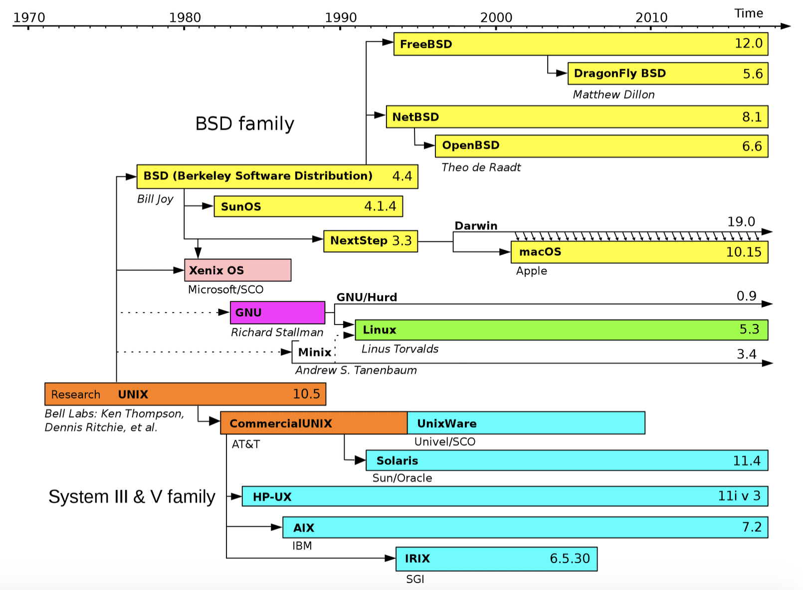

_Linux_ is considered a [Unix-like](https://en.wikipedia.org/wiki/Unix-like) operating system which basically means that Linux derives heavy inspiration from Unix without actually conforming to be a full Unix operating system. macOS and FreeBSD would be two more examples of a Unix-like operating system.

## The history of Linux

## Setting up a linux VM

We’re going to running our Linux through a process call virtualization. We’ll be running a virtual machine which is frequently abbreviated as VMs. VMs are an operating system running within another operating system, called the host machine. The host machine will create a virtual environment with virtual acccess to its hardware to the VM. The VM will have no idea that it’s not actually running on real hardware; all it can see is the resources that the host is providing it.

_Multipass_ provides a command line interface to launch, manage and generally fiddle about with instances of Linux. The downloading of a minty-fresh image takes a matter of seconds, and within minutes a VM can be up and running.

##### Repl

*R*ead *E*valuate *P*rint *L*oop. It’s basically an interactive way of programming where you’re writing one line of code at a time, feeding data in and out of little programs.

# Shell

We are using a _shell_ , and that shell is almost certainly called [bash](<https://en.wikipedia.org/wiki/Bash_(Unix_shell)>) (it definitely is unless you changed something), the *B*ourne *A*gain *Sh*ell (which is making fun of the Bourne shell which bash replaced.) It’s by far the most common shell and is over 30 years old.

### command line

`ls -l` : long display with permissions
`ls -a`: show hidden files and directories
`ls -lsah`: show hidden files, sizes, human readable, all

`tail ~/.bash_history`: where all history lives
`control + R`: reverse search
`!!`: run latest command again
`control + L`: clear

Shortcuts

`CTRL + A` – takes you to the beginning of the line
`CTRL + E` – takes you to the end of the line
`CTRL + K` – "yank" everything after the cursor
`CTRL + U` – "yank" everything before the cursosr
`CTRL + Y` - "paste" (paste in quotes because it doesn't actually go into your system clipboard) everything you yanked
`CTRL + L` - clear the screen
`CTRL + R` – reverse search through history

### Signals

`ctrl + c` - SIGINT

Telling it to **int**errupt what it’s doing and stop. Some programs may not respect CTRL + C, and nearly all of them will take time to clean up after themselves when they do receive a SIGINT.

`ctrl + D` – SIGQUIT

Many programs won’t respond to a SIGQUIT .

SIGTERM
Happens when the computer shuts down. We don’t send SIGTERMs, it’s the computer sending them, go out from the OS.

If I use the kill program to kill another program, the way it does that is by sending a SIGTERM to the program. The difference is that if the program doesn’t exit, kill will still shut down the process. We’ll talk later about kill but know it’s there.

SIGKILL

`kill -l` : all possible kill options.
Usually it’s `kill -9 <process id>`

If you want a program to stop and stop **now**, you can do kill -9 (or kill -SIGKILL) and it will send the SIGKILL which means to the program “don’t clean up, just stop as soon as possible.) Again, we’ll cover this in a bit.
